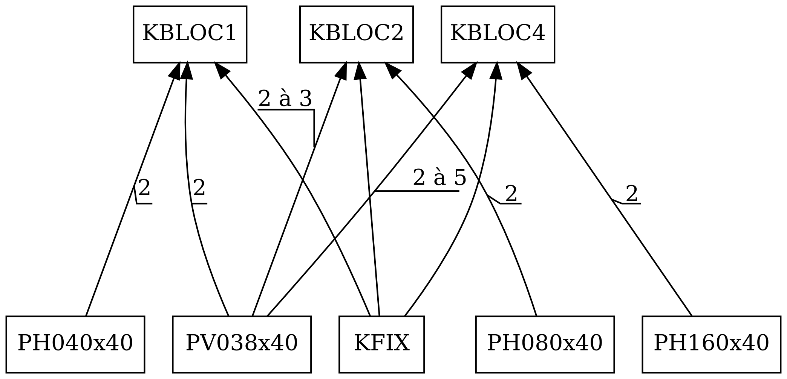
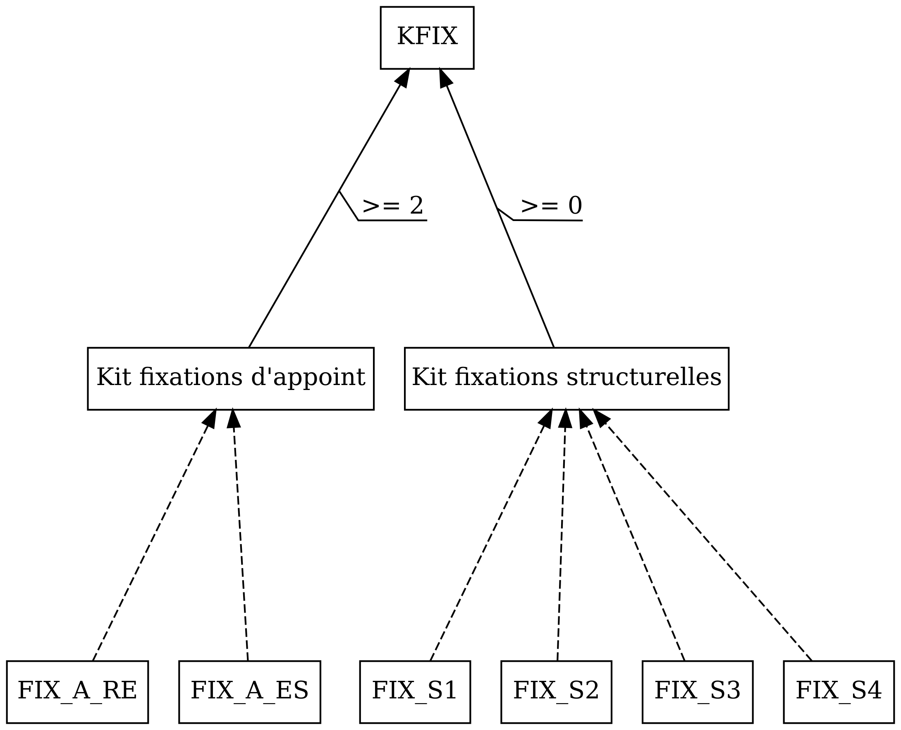
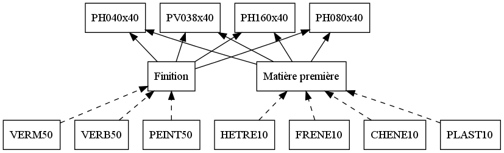
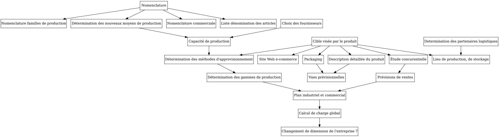

========================================
Projet Picaso : définition de l'activité
========================================

:Cible: classe de population aisée, aimant la technologie.
:Produit: Composants pour construire un intérieur modulaire.

Idée générale du projet
=======================
- Pavé, qu'on assemble pour former des blocs : de rangement, pour cuisine, pour accrocher une télé, pour placer un lave vaisselle/linge.
- Carré de sustentation magnétique (variante : des roues pour des personnes moins riches)
- Accessoires : micros, caméras pour commande vocale, etc. (probablement sous traité).

Activité et produits vendus
===========================
On achète des planches, on découpe, puis on fait la finition (chanfreinage,
vernis, peinture, etc.).
Possibilité pour le client de configurer son intérieur : différentes essences
de bois, couleurs, finition (brillant, mat, etc.), à partir d'un catalogue
présentant différentes combinaisons de teintes, finition, etc.
Il peut ensuite, à partir des éléments présents dans le catalogue, se
construire des éléments.

Exemple
-------
Pour une table, il peut choisir la taille du plateau, et le type de plateau
(épaisseur/taille/essence), parmi une dizaine de combinaison
couleurs/finition/chanfreinage).

Nomenclature
=====================
Produits achetés
----------------
- Planches de différentes essences
- Blocs de sustentation magnétique
- Roulettes
- Système de fixation
- Autres matériaux (pratique, plexiglas, marbre, etc.).

Produits fabriqués
------------------
- Des plateaux prêt à l'emploi (peints, vernis, chanfreinés, avec les emplacements pour fixer les blocs de sustentation magnétique, etc.).

Produits vendu
--------------
- Kits personnalisable (kit table, kit étagère, kit meuble de cuisine, kit table de nuit).
- Éléments à l'unité, pour compléter une solution existence.

======================
Définition des équipes
======================
- Équipe marketing :
    - Paul
    - Martin
    - Monica
- Équipe méthodes :
    - Étienne
    - Yoann
    - Maxime
    - Rémi

===============
Travail à faire
===============
Graphe d'ordonnancement du projet (utilisé comme liste de tâches) :

=====================
Ressources multimédia
=====================
:Meubles à sustentation: http://www.hoverit.co.uk/profile.html
:Vidéo présentant une bonne idée d'architecture d'intérieur: http://www.youtube.com/watch?v=hgI5jSC3NwY

=========
Marketing
=========

Cible 
=====

Nos produits sont destinés à une classe de population aisée, aimant la technologie, 
qui cherche des produits de qualité, innovants, avec une apparence plaisante et surtout 
avec une grande mobilité. La mobilité de notre produit est assurée sur deux plans: la mobilité du transport du produit 
(facilement compacte et par conséquent aisément transportable) et la mobilité du produit pendant son utilisation 
(sustentation magnétique, roulettes). 

Parmi nos clients de lux, la population nordique sera particulièrement visée car, d'après les statistiques ils sont les plus ouverts 
et attirés par les nouveaux designs et ont tendance de dépenser des sommes importantes d'argent pour l'acquisition du meuble hi-tech. 

On ne néglige pas le reste de la la clientèle disposant d'un petit budget qui cherche quand même des produits de qualité ayant une forte 
mobilité, c'est pourquoi on propose une gamme spéciale des mêmes produits mais avec des roulettes. La commercialisation principale sera 
concentré pourtant autour des produits de la gamme de lux.

Ces produits pourront intéresser plusieurs catégories de personnes: 
- Les personnes qui doivent déménager souvent (la possibilité de compacte nos produits rend le transport plus facile).
- Les personnes vivant dans un logement où la place est réduite : l'intérieur devient modulaire.
- Les personnes à mobilité réduite (la sustentation magnétique rend les produits déplaça blés individuellement)

Étude Concurrentielle 
=====================
Étant donné que l'entreprise PICASO est implanté sur le marché depuis une grande période de temps, elle a acquis un avantage favorable par
rapport aux autres entreprises concurrentes. Pourtant, la concurrence reste acerbe. Sur le marché de la meuble il y a un grand nombre d'entreprises
qui proposent des produits de plus en plus attractifs. 
Notre projet mise sur la technologie avancée en ce qui concerne la sustentation magnétique. Actuellement sur le marché il y a très peu des concurrents qui 
commercialisent des meubles à la base de sustentation magnétique. Notre succès reste dans la réactivité de l'entreprise, la qualité et les délais de livraison. 
En plus, notre entreprise ayant adopté une politique écologique, tous nos produits respectent les normes en vigueur.

Vente
=====

Nos produits seront commercialisés principalement sur internet mais ils seront aussi disponibles dans les réseaux de vente de nos partenaires. Un des avantages
de la distribution sur internet est la réduction des coûts de transport. Notre site web, caractérisé par la simplicité, mettra en valeur la qualité de nos produits,
leur confort et la technologie avancée employée.
Nos produits pourront être distribués de deux façons: avec ou sans service de montage. La première façon consistera à acheter le produit et un distributeur partenaire le montera.
La deuxième consistera à acheter le produit et le monter individuellement.
- prix
- différenciation

============================
Réalisation du site internet
============================

Aujourd'hui, 85% des recherches d'un produit commençant sur internet, il est nécessaire que la gamme 
de produits XXX dispose d'une page internet afin d'être promu. 

De plus, XXX s'adressant à une catégorie sociale relativement élevée, elle disposera d'un 
site internet indépendant du site actuel de l'entreprise http://www.picaso-bois.fr, qui s'adresse quant à 
lui à la classe moyenne. 

Afin de promouvoir le produit XXX, PICASO fera donc développer un site internet dédié à cette gamme de 
produit. Le site http://www.picaso-bois.fr disposera quant à lui d'un lien qui renverra vers ce nouveau site 
internet. 

Le site internet présentera donc plusieurs points :
- Un album présentant différents exemples de produits de la gamme XXX.
- Une fenêtre permettant la réalisation virtuelle d'objet de la gamme XXX.
- Un service de SAV.
- Un catalogue téléchargeable en format PDF.

L'album de présentation
=======================

Il donnera accès aux différents produits réalisables par la gamme XXX à travers une série de photographies
de meubles. Ces meubes seront montés, intégrés dans des espaces habitables, et présentés dans différentes 
configurations au sein de ces mêmes espaces habitables afin de présenter l'intérêt du déplacement des meubles.

Devront donc y être présentés à travers au moins une des images :
 - tous les bois offerts par la gamme XXX.
 - toute les planches offerte la gamme XXX.
 - les 2 largeurs de meubles possible dans la gamme XXX.
 - les meubles en suspension lors d'un déplacement (seulement sur une photographie).
 
 
La fenêtre permettant la réalisation virtuelle des objets
=========================================================
Cette fenêre permettra au client, en cours de navigation sur le site internet, de créer son propre meuble de 
façon virtuelle. Il pourra ainsi placer lui-même les planches où il le souhaite, en choisissant le bois et les 
dimensions de chacune d'elles afin de monter petit à petit le meuble qui lui convient.

Lorsque son meuble est réalisé, le client peut ensuite demander un devis de celui-ci qui lui sera fourni 
instantanément par le site. Enfin, s'il le souhaite, il pourra commander le meuble en cliquant sur un bouton. 
Après paiement de celui-ci, une commande numérique est envoyée à PICASO, qui pourra ensuite la traiter.

Le service de SAV
=================
En cas de non satisfaction du client quant à son produit, il pourra demander un retour de celui-ci, notamment par
l'intermédiaire du service de SAV du site internet. 

Lors d'une demande de retour effectuée par l'intermédiaire du site internet, un coupons de retour est envoyé par 
PICASO au client par voie postale. 

Le catalogue
============
Le catalogue présentera des photographies de différents produits réalisables par la gamme XXX. Il reprendra les 
photographies de l'album de présentation et les intégrera parmis d'autres afin de proposer un large gamme d'exemple 
au client. 

Il sera disponible en format PDF, téléchargeable depuis le site internet, et commandable gratuitement en remplissant 
un formulaire, en format papier.

La réalisation du site internet
===============================

Afin de réaliser le site internet, PICASO a fait faire un devis par 4 sociétés :
 +-------------------+------------------------------------+-----------+
 | Société contactée | Nombre de jours de travail estimés | Prix      |
 +-------------------+------------------------------------+-----------+
 | ALIKE GROUP       |                          100 jours |  260 000€ |
 +-------------------+------------------------------------+-----------+
 | AS +              |                          110 jours |  360 000€ |
 +-------------------+------------------------------------+-----------+
 | GROUPE ARCOLE     |                          100 jours |  280 000€ |
 +-------------------+------------------------------------+-----------+
 | SOPRA GROUP       |                           80 jours |  240 000€ |
 +-------------------+------------------------------------+-----------+

Après avoir estimé le prix de la société AS+ trop élevé et le nombre de jours de travail estimés par la 
société SOPRA GROUP trop faible, PICASO a contacté les sociétés ALIKE GROUP et GROUPE ARCOLE afin de 
rencontrer physiquement les prestataires. La société GROUPE ARCOLE ayant semblée plus à l'écoute des besoins 
du produit, PICASO a décidé de s'adresser à celle-ci afin de réaliser le site internet. 

Le devis de 280 000€ se décompose ainsi comme suit :
 +----------------------+---------------------+-----------------+
 | Personnel nécessaire | Nombre de personnes | Coût journalier |
 +----------------------+---------------------+-----------------+
 | Chef de projet       |                   1 |            950€ |
 +----------------------+---------------------+-----------------+
 | Expert technique     |                   1 |            750€ |
 +----------------------+---------------------+-----------------+
 | Développeur          |                   2 |            550€ |
 +----------------------+---------------------+-----------------+
 |                        Coût total par jour |           2800€ |
 +--------------------------------------------+-----------------+
 |                      Nombre de jours total |            100  |
 +--------------------------------------------+-----------------+
 |                                      Devis |        280 000€ |
 +--------------------------------------------+-----------------+

