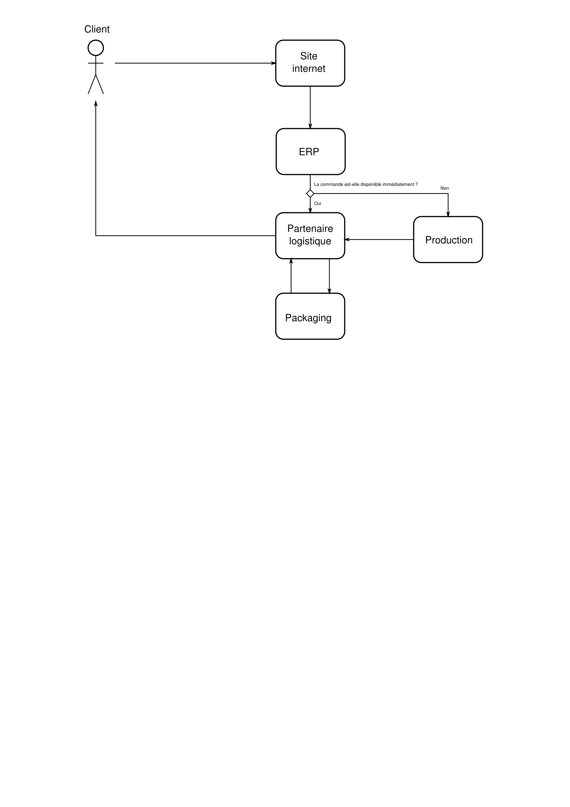

===================================================================
Organisation et gestion de production
===================================================================

===================================================================
Étude de l'extension de la gamme de produits de l'entreprise Picaso
===================================================================

============
Introduction
============
Nous sommes en 2040 et la surpopulation a conduit l'être humain à exploiter tout l'espace nécessaire. En même temps que la densité de population augmentait, la taille des appartement diminuait. La technologie quant à elle a continué d'évoluer et la découverte de nouveaux procédés de fabrication a rendu certains produits comme les blocs de sustentation magnétique très bon marché. Cependant, avec la hausse de prix du pétrole, le plastique est devenue une matière première de luxe et nous assistons à un retour à des matériaux comme le bois.

L'entreprise Picaso, débuta son activité après l'ouverture d'une nouvelle usine en 1996, et son activité principale était la fabrication de bibliothèque en bois. Après un 10 ans de succès modéré, l'entreprise a cessé de lancer de nouvelles gammes de produits. Cependant avec le retour en force des meubles en bois, la société a vu ses venter remonter en flèche au début des années 2030 et c'est pourquoi elle souhaite aujourd'hui combiner des compétences vieilles d'un demi siècle dans le traitement et l'usinage du bois, avec des technologies sûres, fonctionnelles, et abordables.

=================
Dossier marketing
=================

Description du produit
======================

Jazz est un produit innovant, basé sur un concept simple. Chaque personne est
différente, habite un endroit différent, a des goûts différents.

Pourquoi chacun n'aurais-t-il pas le droit de concevoir son meuble comme il le
désire, avec les couleurs et les finition qu'il préfère ? De plus, doit-on se
résoudre à un intérieur figé, alors que de nos jours, nous pouvons nous
permettre de déplacer les meuble sans effort, grâce à la sustentation magnétique
?

Comme le genre musical du même nom, notre produit se veut changeant. Comme le
jazz, il peut être aussi simple ou aussi complexe que vous voulez.

Choix des matériaux et des finitions possibles
==============================================

Recopiage de nomenclature.

Gamme de prix
=============

Pareil.

Stratégie et plan marketing
===========================

Cible du produit
----------------
Nos produits sont destinés à une classe de population moyenne, aimant la technologie, 
qui cherche des produits innovants, avec une apparence plaisante et surtout 
avec une grande mobilité. En effet, le procédé de sustentation magnétique permet
à tout un chacun d'avoir un intérieur modulaire, permettant de déplacer les
meubles pour reconfigurer un intérieur en quelque secondes.

Différentes essences de bois sont proposées, et, les meubles étant parfaitement
configurable, il existe des configurations pour toutes les bourses, du meuble
pour télévision en bois bon marché peint à l'immense armoire en bois massif,
vernis pour laisser transparaitre la qualité du matériaux.

Ces produits pourront intéresser plusieurs catégories de personnes: 
- Les personnes vivant dans un logement où la place est réduite : l'intérieur devient modulaire.
- Les personnes à mobilité réduite (la sustentation magnétique rend les produits déplaçables individuellement)
- Les personnes aimant avoir un intérieur à la pointe de la technologie, innovant, et en même temps très ergonomique.

Étude concurrentielle
---------------------

Étant donné que l'entreprise Picaso est implanté sur le marché depuis une grande période de temps, elle a acquis un avantage concurrentiel par
rapport aux entreprises concurrentes. Pourtant, la concurrence reste active. Sur le marché de la meuble il y a un grand nombre d'entreprises
qui proposent des produits de plus en plus attractifs. 
Notre projet mise sur la technologie avancée en ce qui concerne la sustentation magnétique. Actuellement sur le marché il y a très peu des concurrents qui 
commercialisent des meubles à la base de sustentation magnétique. Notre succès reste dans la réactivité de l'entreprise, la qualité et les délais de livraison. 
De plus, notre entreprise ayant adopté une politique écologique, tous nos produits respectent les normes en vigueur. En effet, le recyclage est pris en compte dans le cycle de vie du produit. Les arbres sont bien évidemment replantés.

Prévisions de vente
-------------------

Monica, à toi !

L'entreprise Picaso
===================

L'entreprise Picaso, fort d'une longue expérience dans la fabrication de meuble
(depuis 1990), est gage de qualité. Dans l'optique de conserver l'image de
marque convoyé par l'enseigne, la localisation d'origine sera conservée, à
savoir Ayze en Haute-Savoie. Au niveau communication, bien qu'une nouvelle
charte graphique sera crée pour la gamme Jazz, elle reprendra, dans les grandes
lignes, les tendances que l'on trouve dans les autres gammes, afin d'augmenter
la cohérence globale de la marque, et de ne pas perdre le consommateur.

La distribution
===============

Moyen de distribution
---------------------

Aujourd'hui, 85% des recherches d'un produit commençant sur internet, il est nécessaire que la gamme 
de produits Jazz dispose d'une page internet afin d'être promu. 

La gamme étant en rupture avec le type de meuble que fournis normalement Picaso, elle disposera d'un site internet
à par entière, afin de renforcer l'aspect renouveau et moderne.

Afin de promouvoir le produit Jazz, PICASO fera donc développer un site internet dédié à cette gamme de 
produit. Le site http://www.picaso-bois.fr disposera quant à lui d'un lien qui renverra vers ce nouveau site 
internet. 

Le site internet présentera donc plusieurs points :
- Un album présentant différents exemples de produits de la gamme Jazz.
- Une fenêtre permettant la réalisation virtuelle d'objet de la gamme Jazz.
- Un service de SAV
- Un catalogue téléchargeable en format PDF.

Premièrement, une galerie donnera accès aux différents produits réalisables par la gamme Jazz à travers une série de photographies
de meubles. Ces meubles seront montés, intégrés dans des espaces habitables, et présentés dans différentes 
configurations au sein de ces mêmes espaces habitables afin de présenter l'intérêt du déplacement des meubles.

Devront donc y être présentés à travers au moins une des images :
 - Tous les bois offerts par la gamme Jazz.
 - Toute les planches offerte la gamme Jazz.
 - Les 2 largeurs de meubles possible dans la gamme Jazz.
 - Les meubles en suspension lors d'un déplacement (seulement sur une photographie).
 
Ensuite, par le menu, le client, en cours de navigation sur le site internet, pourra créer son propre meuble de 
façon virtuelle. Il pourra ainsi placer lui-même les planches où il le souhaite, en choisissant le bois et les 
dimensions de chacune d'elles afin de monter petit à petit le meuble qui lui convient.

Lorsque son meuble est réalisé, le client peut ensuite demander un devis de celui-ci qui lui sera fourni 
instantanément par le site. Enfin, s'il le souhaite, il pourra commander le meuble en cliquant sur un bouton. 
Après paiement de celui-ci, une commande numérique est envoyée à Picaso, qui pourra ensuite la traiter.

En cas de non satisfaction du client quant à son produit, il pourra demander un retour de celui-ci, notamment par
l'intermédiaire du service de SAV du site internet. 

Lors d'une demande de retour effectuée par l'intermédiaire du site internet, un coupons de retour est envoyé par 
Picaso au client par voie postale. 

Enfin, le catalogue présentera des photographies de différents produits réalisables par la gamme Jazz. Il reprendra les 
photographies de l'album de présentation et les intégrera parmi d'autres afin de proposer un large gamme d'exemple 
au client. 

Il sera disponible en format PDF, téléchargeable depuis le site internet, et pourra s'obtenir gratuitement en format papier 
en remplissant un formulaire.

Afin de réaliser le site internet, PICASO a fait faire un devis par 4 sociétés :
 +-------------------+------------------------------------+-----------+
 | Société contactée | Nombre de jours de travail estimés | Prix      |
 +-------------------+------------------------------------+-----------+
 | ALIKE GROUP       |                          100 jours |  260 000€ |
 +-------------------+------------------------------------+-----------+
 | AS +              |                          110 jours |  360 000€ |
 +-------------------+------------------------------------+-----------+
 | GROUPE ARCOLE     |                          100 jours |  280 000€ |
 +-------------------+------------------------------------+-----------+
 | SQLi Group        |                           80 jours |  240 000€ |
 +-------------------+------------------------------------+-----------+

Après avoir estimé le prix de la société AS+ trop élevé et le nombre de jours de travail estimés par la 
société SQLi Group trop faible, PICASO a contacté les sociétés ALIKE GROUP et GROUPE ARCOLE afin de 
rencontrer physiquement les prestataires. La société GROUPE ARCOLE ayant semblée plus à l'écoute des besoins 
du produit, PICASO a décidé de s'adresser à celle-ci afin de réaliser le site internet. 

Le devis de 280 000€ se décompose ainsi comme suit :
 +----------------------+---------------------+-----------------+
 | Personnel nécessaire | Nombre de personnes | Coût journalier |
 +----------------------+---------------------+-----------------+
 | Chef de projet       |                   1 |            950€ |
 +----------------------+---------------------+-----------------+
 | Expert technique     |                   1 |            750€ |
 +----------------------+---------------------+-----------------+
 | Développeur          |                   2 |            550€ |
 +----------------------+---------------------+-----------------+
 |                        Coût total par jour |           2800€ |
 +--------------------------------------------+-----------------+
 |                      Nombre de jours total |            100  |
 +--------------------------------------------+-----------------+
 |                                      Devis |        280 000€ |
 +--------------------------------------------+-----------------+

Les expéditions seront quant à elles assurées par un prestataire technique en
logistique, qui pourra mettre son expérience et son expertise au service de
notre entreprise, assurant des délais que seule une entreprise spécialisée peut
se permettre d'atteindre.

Les contraintes sont qu'un meuble, dès la commande, doit être chez le client en
deux semaines. Pour ce faire, notre partenaire disposera de plusieurs *hub* de
livraison.
Il prendra, de la même manière, en charge l'emballage des commandes clients.
Le schéma suivant permet de résumer le processus d'une commande client.

====================
Dossier des méthodes
====================

Nomenclature ligne de production
================================

.. image:: nomenclature/bloc.png
.. image:: nomenclature/fixations.png
.. image:: nomenclature/planches.png
Postes de charge
================

Dénomination des articles
=========================

Nomenclatures
=============

Approvisionnement
=================

Planification des charges
==========================
