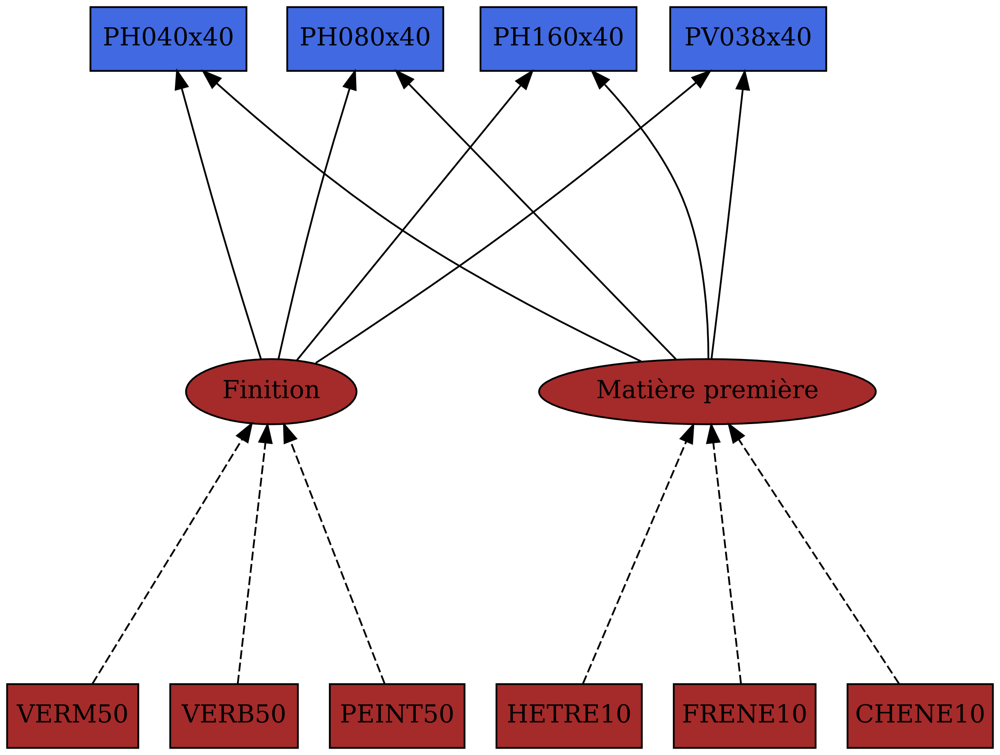

===================================================================
Organisation et gestion de production
===================================================================

===================================================================
Étude de l'extension de la gamme de produits de l'entreprise Picaso
===================================================================

============
Introduction
============
Nous sommes en 2040 et la surpopulation a conduit l'être humain à exploiter tout l'espace nécessaire. En même temps que la densité de population augmentait, la taille des appartement diminuait. La technologie quant à elle a continué d'évoluer et la découverte de nouveaux procédés de fabrication a rendu certains produits comme les blocs de sustentation magnétique très bon marché. Cependant, avec la hausse de prix du pétrole, le plastique est devenue une matière première de luxe et nous assistons à un retour à des matériaux comme le bois.

L'entreprise Picaso, débuta son activité après l'ouverture d'une nouvelle usine en 1996, et son activité principale était la fabrication de bibliothèque en bois. Après un 10 ans de succès modéré, l'entreprise a cessé de lancer de nouvelles gammes de produits. Cependant avec le retour en force des meubles en bois, la société a vu ses venter remonter en flèche au début des années 2030 et c'est pourquoi elle souhaite aujourd'hui combiner des compétences vieilles d'un demi siècle dans le traitement et l'usinage du bois, avec des technologies sûres, fonctionnelles, et abordables.

=================
Dossier marketing
=================

Description du produit
======================

Jazz est un produit innovant, basé sur un concept simple. Chaque personne est
différente, habite un endroit différent, a des goûts différents.

Pourquoi chacun n'aurais-t-il pas le droit de concevoir son meuble comme il le
désire, avec les couleurs et les finition qu'il préfère ? De plus, doit-on se
résoudre à un intérieur figé, alors que de nos jours, nous pouvons nous
permettre de déplacer les meuble sans effort, grâce à la sustentation magnétique
?

Comme le genre musical du même nom, notre produit se veut changeant. Comme le
jazz, il peut être aussi simple ou aussi complexe que vous voulez.

Choix des matériaux et des finitions possibles
==============================================

Nous proposons trois essences de bois : chêne, hêtre et frêne. Les couleurs
possibles sont (en notation Pantone) pétrole (bleu), pomme (vert) et ivoire
(blanc cassé). Il est aussi possible d'avoir une finition laissant apparaître le
bois, en mat ou brillant.

Gamme de prix
=============

Un kit bloc 1 est disponible à 47€, un kit bloc 2 à 130€, et enfin, le kit bloc
3 est disponible à partir de 220€. 

Stratégie et plan marketing
===========================

Cible du produit
----------------
Nos produits sont destinés à une classe de population moyenne, aimant la technologie, 
qui cherche des produits innovants, avec une apparence plaisante et surtout 
avec une grande mobilité. En effet, le procédé de sustentation magnétique permet
à tout un chacun d'avoir un intérieur modulaire, permettant de déplacer les
meubles pour reconfigurer un intérieur en quelque secondes.

Différentes essences de bois sont proposées, et, les meubles étant parfaitement
configurable, il existe des configurations pour toutes les bourses, du meuble
pour télévision en bois bon marché peint à l'immense armoire en bois massif,
vernis pour laisser transparaitre la qualité du matériaux.

Ces produits pourront intéresser plusieurs catégories de personnes: 
- Les personnes vivant dans un logement où la place est réduite : l'intérieur devient modulaire.
- Les personnes à mobilité réduite (la sustentation magnétique rend les produits déplaçables individuellement)
- Les personnes aimant avoir un intérieur à la pointe de la technologie, innovant, et en même temps très ergonomique.

Étude concurrentielle
---------------------

Étant donné que l'entreprise Picaso est implanté sur le marché depuis une grande période de temps, elle a acquis un avantage concurrentiel par
rapport aux entreprises concurrentes. Pourtant, la concurrence reste active. Sur le marché de la meuble il y a un grand nombre d'entreprises
qui proposent des produits de plus en plus attractifs. 
Notre projet mise sur la technologie avancée en ce qui concerne la sustentation magnétique. Actuellement sur le marché il y a très peu des concurrents qui 
commercialisent des meubles à la base de sustentation magnétique. Notre succès reste dans la réactivité de l'entreprise, la qualité et les délais de livraison. 
De plus, notre entreprise ayant adopté une politique écologique, tous nos produits respectent les normes en vigueur. En effet, le recyclage est pris en compte dans le cycle de vie du produit. Les arbres sont bien évidemment replantés.

Prévisions de vente
-------------------
Nous commercialisons 3 types de produits, que l'on distingue en fonction de leur dimensions. Sous forme de meuble en kit à monter soit même, les kits contiennent un, deux ou trois bloc standards. Nous envisageons que le plus vendu sera le Kit Bloc x1 car il est le plus petit et facile à transporter. Ensuite, la préférence se fera au Kit Bloc x4, suivi du Kit Bloc x2. Celui-ci a une dimension assez particulière (2 blocs). Le public préfèrera acheter un produit de grande taille plutôt qu'un produit de taille moyenne qui peut laisser de l'espace non utilisé dans la pièce. En même temps le kit de dimension x2 peut intéresser les personnes qui ne possèdent pas beaucoup d'espace d'espace, comme les étudiants, les personnes vivant dans des endroit où la surface habitable est chère. Nous enregistrons une augmentation des ventes dans les périodes de vacances scolaires (pendant l'été spécialement mais aussi avant Noël) et avant la rentrée scolaire (spécialement pour les Kit Bloc x2 qui peuvent être intéressantes pour les étudiants). 

Au niveau des finitions la peinture sera la plus demandée car elle est la moins chère et plus facile à entretenir. Le vernis demande plus de soin et des précautions au moment du transport. Entre les vernis mats et brillants, après avoir effectué plusieurs études, nous avons remarqués que le vernis mat correspond beaucoup plus à la tendance actuelle.

Du point de vue de la matière première utilisée le chêne est le plus commun et connu donc sera le plus demandé. Les préférences pour le hêtre et le frêne seront partagées également.

L'entreprise Picaso
===================

L'entreprise Picaso, fort d'une longue expérience dans la fabrication de meuble
(depuis 1990), est gage de qualité. Dans l'optique de conserver l'image de
marque convoyé par l'enseigne, la localisation d'origine sera conservée, à
savoir Ayze en Haute-Savoie. Au niveau communication, bien qu'une nouvelle
charte graphique sera crée pour la gamme Jazz, elle reprendra, dans les grandes
lignes, les tendances que l'on trouve dans les autres gammes, afin d'augmenter
la cohérence globale de la marque, et de ne pas perdre le consommateur.

La distribution
===============

Moyen de distribution
---------------------

Aujourd'hui, 85% des recherches d'un produit commençant sur internet, il est nécessaire que la gamme 
de produits Jazz dispose d'une page internet afin d'être promu. 

La gamme étant en rupture avec le type de meuble que fournis normalement Picaso, elle disposera d'un site internet
à par entière, afin de renforcer l'aspect renouveau et moderne.

Afin de promouvoir le produit Jazz, PICASO fera donc développer un site internet dédié à cette gamme de 
produit. Le site http://www.picaso-bois.fr disposera quant à lui d'un lien qui renverra vers ce nouveau site 
internet. 

Le site internet présentera donc plusieurs points :
- Un album présentant différents exemples de produits de la gamme Jazz.
- Une fenêtre permettant la réalisation virtuelle d'objet de la gamme Jazz.
- Un service de SAV
- Un catalogue téléchargeable en format PDF.

Premièrement, une galerie donnera accès aux différents produits réalisables par la gamme Jazz à travers une série de photographies
de meubles. Ces meubles seront montés, intégrés dans des espaces habitables, et présentés dans différentes 
configurations au sein de ces mêmes espaces habitables afin de présenter l'intérêt du déplacement des meubles.

Devront donc y être présentés à travers au moins une des images :
 - Tous les bois offerts par la gamme Jazz.
 - Toute les planches offerte la gamme Jazz.
 - Les 2 largeurs de meubles possible dans la gamme Jazz.
 - Les meubles en suspension lors d'un déplacement (seulement sur une photographie).
 
Ensuite, par le menu, le client, en cours de navigation sur le site internet, pourra créer son propre meuble de 
façon virtuelle. Il pourra ainsi placer lui-même les planches où il le souhaite, en choisissant le bois et les 
dimensions de chacune d'elles afin de monter petit à petit le meuble qui lui convient.

Lorsque son meuble est réalisé, le client peut ensuite demander un devis de celui-ci qui lui sera fourni 
instantanément par le site. Enfin, s'il le souhaite, il pourra commander le meuble en cliquant sur un bouton. 
Après paiement de celui-ci, une commande numérique est envoyée à Picaso, qui pourra ensuite la traiter.

En cas de non satisfaction du client quant à son produit, il pourra demander un retour de celui-ci, notamment par
l'intermédiaire du service de SAV du site internet. 

Lors d'une demande de retour effectuée par l'intermédiaire du site internet, un coupons de retour est envoyé par 
Picaso au client par voie postale. 

Enfin, le catalogue présentera des photographies de différents produits réalisables par la gamme Jazz. Il reprendra les 
photographies de l'album de présentation et les intégrera parmi d'autres afin de proposer un large gamme d'exemple 
au client. 

Il sera disponible en format PDF, téléchargeable depuis le site internet, et pourra s'obtenir gratuitement en format papier 
en remplissant un formulaire.

Afin de réaliser le site internet, PICASO a fait faire un devis par 4 sociétés :
 +-------------------+------------------------------------+-----------+
 | Société contactée | Nombre de jours de travail estimés | Prix      |
 +-------------------+------------------------------------+-----------+
 | ALIKE GROUP       |                          100 jours |  260 000€ |
 +-------------------+------------------------------------+-----------+
 | AS +              |                          110 jours |  360 000€ |
 +-------------------+------------------------------------+-----------+
 | GROUPE ARCOLE     |                          100 jours |  280 000€ |
 +-------------------+------------------------------------+-----------+
 | SQLi Group        |                           80 jours |  240 000€ |
 +-------------------+------------------------------------+-----------+

Après avoir estimé le prix de la société AS+ trop élevé et le nombre de jours de travail estimés par la 
société SQLi Group trop faible, PICASO a contacté les sociétés ALIKE GROUP et GROUPE ARCOLE afin de 
rencontrer physiquement les prestataires. La société GROUPE ARCOLE ayant semblée plus à l'écoute des besoins 
du produit, PICASO a décidé de s'adresser à celle-ci afin de réaliser le site internet. 

Le devis de 280 000€ se décompose ainsi comme suit :
 +----------------------+---------------------+-----------------+
 | Personnel nécessaire | Nombre de personnes | Coût journalier |
 +----------------------+---------------------+-----------------+
 | Chef de projet       |                   1 |            950€ |
 +----------------------+---------------------+-----------------+
 | Expert technique     |                   1 |            750€ |
 +----------------------+---------------------+-----------------+
 | Développeur          |                   2 |            550€ |
 +----------------------+---------------------+-----------------+
 |                        Coût total par jour |           2800€ |
 +--------------------------------------------+-----------------+
 |                      Nombre de jours total |            100  |
 +--------------------------------------------+-----------------+
 |                                      Devis |        280 000€ |
 +--------------------------------------------+-----------------+

Les expéditions seront quant à elles assurées par un prestataire technique en
logistique, qui pourra mettre son expérience et son expertise au service de
notre entreprise, assurant des délais que seule une entreprise spécialisée peut
se permettre d'atteindre.

Les contraintes sont qu'un meuble, dès la commande, doit être chez le client en
deux semaines. Pour ce faire, notre partenaire disposera de plusieurs *hub* de
livraison.
Il prendra, de la même manière, en charge l'emballage des commandes clients.
Le schéma suivant permet de résumer le processus d'une commande client.

.. image:: processAcheminement.png

====================
Dossier des méthodes
====================

Postes de charge
================

Formation des kits blocs (KBLOC1, KBLOC2, KBLOC4)
-------------------------------------------------

+----------------------------+------------------+
| Poste de charge            | Charge (heures)  |
+----------------------------+------------------+
| Acquisition planches       | 0.15             | 
+----------------------------+------------------+
| Conditionnement kits blocs | 0.10             |
+----------------------------+------------------+

Formation des kits fixations (KFIX)
-----------------------------------

+----------------------------------+------------------+
| Poste de charge                  | Charge (heures)  |
+----------------------------------+------------------+
| Acquisition fixations            | 0.05             | 
+----------------------------------+------------------+
| Conditionnement kits fixations   | 0.05             |
+----------------------------------+------------------+

Production des éléments standards (PH040x40, PH080x40 PH160x40, PV038x40)
-------------------------------------------------------------------------

+----------------------------+------------------+
| Poste de charge            | Charge (heures)  |
+----------------------------+------------------+
| Découpe bois               | 0.25             |
+----------------------------+------------------+
| Usinage bois               | 0.50             |
+----------------------------+------------------+
| Finition                   | 0.20             |
+----------------------------+------------------+

Dénomination des articles
=========================

Les articles dans le tableau ci-dessous sont ceux gérés par l'entreprise.
Dans la colonne type, F signifie fabriqué, A signifie acheté.
Dans la colonne unité, le nombre est le multiple par lequel on achète l'article.
Dans la colonne magasin PF signifie produit fini, EC signifie en cours, et MP
signifie matière première.

+--------+--------------------+----------------------------------------+--------------+-------------+---------------------------+
|  Type  | Code               | Libellé                                | Unité        | Magasin     | Délai d'obtention (jours) |
+--------+--------------------+----------------------------------------+--------------+-------------+---------------------------+
|   F    | KBLOC1             | Kit bloc simple                        | 1            | PF          |                           |
+--------+--------------------+----------------------------------------+--------------+-------------+---------------------------+
|   F    | KBLOC2             | Kit bloc double                        | 1            | PF          |                           |
+--------+--------------------+----------------------------------------+--------------+-------------+---------------------------+
|   F    | KBLOC4             | Kit bloc quadruple                     | 1            | PF          |                           |
+--------+--------------------+----------------------------------------+--------------+-------------+---------------------------+
|   F    | PH040x40           | Planche horizontale 40x40cm            | 1            | EC          |                           |
+--------+--------------------+----------------------------------------+--------------+-------------+---------------------------+
|   F    | PH080x40           | Planche horizontale 80x40cm            | 1            | EC          |                           |
+--------+--------------------+----------------------------------------+--------------+-------------+---------------------------+
|   F    | PH160x40           | Planche horizontale 160x40cm           | 1            | EC          |                           |
+--------+--------------------+----------------------------------------+--------------+-------------+---------------------------+
|   F    | PV038x40           | Planche verticale 38x40cm              | 1            | EC          |                           |
+--------+--------------------+----------------------------------------+--------------+-------------+---------------------------+
|   A    | VERM50             | Vernis mat 50L                         | 1            | MP          | 5                         |
+--------+--------------------+----------------------------------------+--------------+-------------+---------------------------+
|   A    | VERB50             | Vernis brillant 50L                    | 1            | MP          | 5                         |
+--------+--------------------+----------------------------------------+--------------+-------------+---------------------------+
|   A    | PEINT50            | Peinture 50L                           | 1            | MP          | 5                         |
+--------+--------------------+----------------------------------------+--------------+-------------+---------------------------+
|   A    | HETRE10            | Hêtre 10mm (2mx2m)                     | 10           | MP          | 15                        |
+--------+--------------------+----------------------------------------+--------------+-------------+---------------------------+
|   A    | FRENE10            | Frêne 10mm (2mx2m)                     | 10           | MP          | 15                        |
+--------+--------------------+----------------------------------------+--------------+-------------+---------------------------+
|   A    | CHENE10            | Chêne 10mm (2mx2m)                     | 10           | MP          | 15                        |
+--------+--------------------+----------------------------------------+--------------+-------------+---------------------------+
|   F    | KFIX               | Kit de fixations                       | 1            | EC          |                           |
+--------+--------------------+----------------------------------------+--------------+-------------+---------------------------+
|   A    | FIX_1              | Fixation simple (bloc non fixé)        | 100          | MP          | 5 (Gestion sur stocks)    |
+--------+--------------------+----------------------------------------+--------------+-------------+---------------------------+
|   A    | FIX_2              | Fixation double hauteur (bloc à bloc)  | 100          | MP          | 5 (Gestion sur stocks)    |
+--------+--------------------+----------------------------------------+--------------+-------------+---------------------------+

Nomenclatures
=============

Sous forme de tableau :

+--------------------+------------+--------------------+-------------------+
| Article            | Séquence   | Composant          | Coefficient       |
+--------------------+------------+--------------------+-------------------+
| KBLOC1             | 001        | PH040x40           | 2                 |
|                    +------------+--------------------+-------------------+
|                    | 002        | PV038x40 + 2 KFIX  | 2                 |
+--------------------+------------+--------------------+-------------------+
| KBLOC2             | 001        | PH080x40           | 2                 |
|                    +------------+--------------------+-------------------+
|                    | 002        | PV038x40 + 2 KFIX  | MIN 2, MAX 3      |
+--------------------+------------+--------------------+-------------------+
| KBLOC4             | 001        | PH160x40           | 2                 |
|                    +------------+--------------------+-------------------+
|                    | 002        | PV038x40 + 2 KFIX  | MIN 2, MAX 5      |
+--------------------+------------+----+---------------+-------------------+
| PV038x40           | 001        |    | HETRE10       | 0.0625            |
|                    |            |    +---------------+-------------------+
|                    |            | OU | FRENE10       | 0.0625            |
|                    |            |    +---------------+-------------------+
|                    |            |    | CHENE10       | 0.0625            |
|                    +------------+----+---------------+-------------------+
|                    | 002        |    | VERM50        | 0.025             |
|                    |            |    +---------------+-------------------+
|                    |            | OU | VERB50        | 0.025             |
|                    |            |    +---------------+-------------------+
|                    |            |    | PEINT50       | 0.025             |
+--------------------+------------+----+---------------+-------------------+
| PH040x40           | 001        |    | HETRE10       | 0.0625            |
|                    |            |    +---------------+-------------------+
|                    |            | OU | FRENE10       | 0.0625            |
|                    |            |    +---------------+-------------------+
|                    |            |    | CHENE10       | 0.0625            |
|                    +------------+----+---------------+-------------------+
|                    | 002        |    | VERM50        | 0.025             |
|                    |            |    +---------------+-------------------+
|                    |            | OU | VERB50        | 0.025             |
|                    |            |    +---------------+-------------------+
|                    |            |    | PEINT50       | 0.025             |
+--------------------+------------+----+---------------+-------------------+
| PH080x40           | 001        |    | HETRE10       | 0.125             |
|                    |            |    +---------------+-------------------+
|                    |            | OU | FRENE10       | 0.125             |
|                    |            |    +---------------+-------------------+
|                    |            |    | CHENE10       | 0.125             |
|                    +------------+----+---------------+-------------------+
|                    | 002        |    | VERM50        | 0.05              |
|                    |            |    +---------------+-------------------+
|                    |            | OU | VERB50        | 0.05              |
|                    |            |    +---------------+-------------------+
|                    |            |    | PEINT50       | 0.05              |
+--------------------+------------+----+---------------+-------------------+
| PH160x40           | 001        |    | HETRE10       | 0.25              |
|                    |            |    +---------------+-------------------+
|                    |            | OU | FRENE10       | 0.25              |
|                    |            |    +---------------+-------------------+
|                    |            |    | CHENE10       | 0.25              |
|                    +------------+----+---------------+-------------------+
|                    | 002        |    | VERM50        | 0.1               |
|                    |            |    +---------------+-------------------+
|                    |            | OU | VERB50        | 0.1               |
|                    |            |    +---------------+-------------------+
|                    |            |    | PEINT50       | 0.1               |
+--------------------+------------+----+---------------+-------------------+

Approvisionnement
=================

Les matières premières sont gérées en MRP0, car ceci permet de déterminer
les besoins à partir des demandes en produit finis, et des approvisionnements
existants.

Les produits standards sont gérés en utilisant une méthode MRP1. En effet,
cette méthode permet, en plus d'estimer la production nécessaire en produits
standards, des charges sur chaque poste.

Les fournitures sont gérés sur stock, parce qu'un stock de vis, par exemple,
peut être acheté, et la commande peut être effectué lorsque le stock descend
trop.

L'expédition se fait en Kanban, mais nous n'avons qu'un seul poste.

Production annuelle
===================
La production annuelle est de 6600 kits par an. Cela fait donc environ 20 kits
par jour, donc un besoin de 80 planches par jour.

Production actuelle
===================
Actuellement, nous avons une capacité de production de 2000 planches par tranches de 8h.
Une partie de cette capacité sera dédié à la production de planches pour nos kits.
(L'ancienne production sera réduite, permettant d'éviter d'avoir à acheter de
 nouvelles machines, ou d'embaucher du personnel).

L'équipement actuel est donc de :

10 perceuses Zenith MORBIDELLI → 10 personnes / 8h
10 Sculpteuses 3D : R200 Robot ROUTECH → 10 personnes / 8h
2 ponceuses Linee Unisand K DMC → 2 personnes / 8h
4 ponceuses de côté (chanfrein) Solution Evolution STEFANI → 4 personnes / 8h
10 raboteuses S 6300 L'invincable SCM → 10 personnes / 8h
10 scieuses : SI 6000 L'invincable Table Saw SCM → 20 personnes / 8h
20 Tunnels de finition et de sechage : CEFLA CATTINAIR BARBERAN mm 1300 → 20 personnes / 8h

Soit un total humain de 76 personnes / 8h

Nouvelles machines
==================

Découpe
-------
* Outil : Scieuse
* Modèle : SI 6000 L'invincable Table Saw SCM (http://www.scmgroup-usa.com/prod-SI_6000_L_invincable_Table_Saw-19.aspx)
* Capacité : ~ 200 planches / 8h
* Effectif requis : 2 superviseurs
* Application à Jazz : PH160x40, PH080x40, PH040x40, PV038x40
* Description :
    Découpe des planches HETRE10, CHENE10, FRENE10 (2x2m) en planches de format 38x40, 40x40, 80x40 ou 160x40cm, selon le produit standard cible.

Perçage
-------
* Outil : Perceuse
* Modèle : Zenith MORBIDELLI (http://www.scmgroup-usa.com/prod-Zenith-111.aspx)
* Capacité : ~200 planches / 8h
* Effectif requis : 1 opérateur
* Application à Jazz : PH160x40, PH080x40, PH040x40, PV038x40
* Description :
    Perçage des emplacement de fixation :
      * PV038x40 : 4 trous diamètre 4mm, profondeur 20mm et 4 trous diamètre 20mm, profondeur 7mm
      * PV040x40 : 4 trous diamètre 4mm, profondeur 10mm
      * PV040x40 : 6 trous diamètre 4mm, profondeur 10mm
      * PV040x40 : 10 trous diamètre 4mm, profondeur 10mm

Sculpture / Gravure
-------------------
* Outil : Sculpteuse 3D
* Modèle : R200 Robot ROUTECH (http://www.scmgroup-usa.com/prod-R200_Robot-74.aspx)
* Capacité : ~ 200 planches / 8h
* Effectif requis : 1 opérateur
* Application à Jazz : Non
* Description :
    Scrulpture de décorations sur d'autres modèles de meubles. Non utilisé pour Jazz.

Ponçage
-------
* Outil : Ponceuse
* Modèle : Linee Unisand K DMC (http://www.scmgroup-usa.com/prod-Linee_Unisand_K-81.aspx)
* Capacité : ~ 1000 planches / 8h
* Effectif requis : 1 superviseur
* Application à Jazz : PH160x40, PH080x40, PH040x40, PV038x40
* Description :
    Ponçage des planches, fournies brutes.

Chanfreinage
------------
* Outil : Chanfreineuse
* Modèle : Solution Evolution STEFANI (http://www.scmgroup-usa.com/prod-Solution_Evolution-96.aspx)
* Capacité : 500 planches / 8h
* Effectif requis : 1 superviseur
* Application à Jazz : PH160x40, PH080x40, PH040x40 
* Description :
    Chanfreinage des bords destinés à être apparents (à l'extérieur des blocs).

Rabotage
----------
* Outil : Raboteuse
* Modèle : S 6300 L'invincable SCM (http://www.scmgroup-usa.com/prod-S_6300_L_invincable-36.aspx)
* Capacité : ~ 200 planches / 8h
* Effectif requis : 1 superviseur
* Application à Jazz : Non
* Description :
    Rabotage en vue d'augmenter la rectitude de la planche. Non utilisé pour Jazz.

Finition
--------
* Outil : Tunnel de finition et de sechage
* Modèle : CEFLA CATTINAIR BARBERAN mm 1300 (http://www.sofitnet.it/fra/scheda/MZ0122/ligne-de-vernissage-cefla-cattinair-barberan-mm-1300)
* Capacité : ~ 100 planches / 8h
* Effectif requis : 1 superviseur
* Description :
    Application du vernie, et des finitions, puis séchage.

Estimation
==========
Environ 100 000 € par machine

Évolution nécessaire
====================
Afin d'éviter toute modification des effectifs humain et machines, l'idéal est de diminuer la production actuelle pour la remplacer des la production des produits Jazz.
Ainsi, un minimum de coût supplémentaire est demandé, et si la production actuelle, est bien calibré, la nouvelle production le sera puisque l'occupation des postes de charges est à peu de chose près la même.

Planification des charges
==========================

